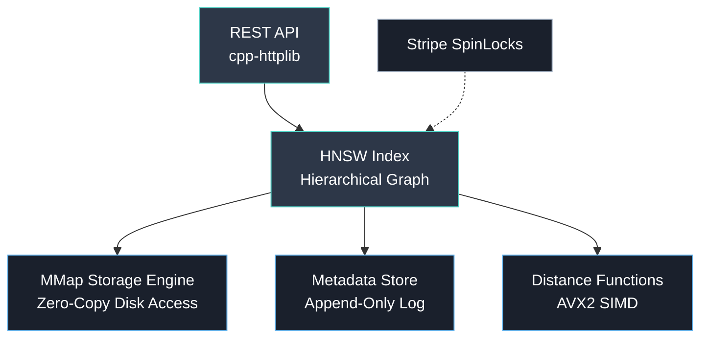

<div align="center">

```
    _   __                  ____  ____
   / | / /___ _____  ____  / __ \/ __ )
  /  |/ / __ `/ __ \/ __ \/ / / / __  |
 / /|  / /_/ / / / / /_/ / /_/ / /_/ /
/_/ |_/\__,_/_/ /_/\____/_____/_____/
```

**A vector search engine built from scratch in C++17.**

Sub-millisecond ANN search. Zero external dependencies. Runs in Docker.

[](https://github.com/shlokkvaishnav/nano-db/actions)


[](https://github.com/shlokkvaishnav/nano-db/pkgs/container/nanodb)

</div>

---

## Why NanoDB?

|  | FAISS | Milvus | **NanoDB** |
|---|---|---|---|
| Persistent storage | No | Yes | **Yes** (mmap) |
| External dependencies | BLAS/LAPACK | etcd, MinIO, Pulsar | **None** |
| REST API | No | Yes | **Yes** |
| Docker deployment | Manual | ~500MB image | **Minimal image** |
| Build from source | Complex | Complex | **Single cmake command** |

NanoDB bridges the gap between raw algorithms (FAISS) and full-scale distributed databases (Milvus) — a single-binary, persistent vector engine you can deploy in seconds.

---

## Quick Start

### Docker (fastest)

```bash
docker run -p 8080:8080 ghcr.io/shlokkvaishnav/nanodb

# Insert a vector
curl -X POST localhost:8080/vectors \
  -H "Content-Type: application/json" \
  -d '{"id": 0, "vector": [0.1, 0.2, ...], "metadata": "example"}'

# Search
curl -X POST localhost:8080/search \
  -H "Content-Type: application/json" \
  -d '{"vector": [0.1, 0.2, ...], "k": 5}'
```

### Build from Source

```bash
git clone --recursive https://github.com/shlokkvaishnav/nano-db.git
cd nano-db
cmake -B build -DCMAKE_BUILD_TYPE=Release -DNANODB_BUILD_PYTHON=OFF
cmake --build build -j$(nproc)

# Run the server
./build/nano_server

# Run tests
cd build && ctest --output-on-failure
```

**Prerequisites:** C++17 compiler, CMake 3.10+, CPU with AVX2 (Intel Haswell 2013+ / AMD Ryzen 2017+)

---

## REST API

| Method | Endpoint | Body | Response |
|--------|----------|------|----------|
| `POST` | `/vectors` | `{"id": uint32, "vector": [float x 128], "metadata": "string"}` | `201 {"status": "ok", "id": 0}` |
| `POST` | `/search` | `{"vector": [float x 128], "k": int}` | `200 {"results": [{"id", "distance", "metadata"}...]}` |
| `DELETE` | `/vectors/:id` | — | `200 {"status": "ok", "id": 0}` |
| `GET` | `/stats` | — | `200 {"element_count", "vector_dim", "metric"}` |

---

## Benchmarks

> **Hardware:** Intel Core i7-12700H (14C/20T, 4.7 GHz boost) | 16GB DDR5-4800 | Windows 11  
> **Config:** 128-dimensional float32 vectors, M=16, ef_construction=200

| Metric | Single-Threaded | 8 Threads |
|--------|----------------|-----------|
| Insert throughput | ~2,200 TPS | **~6,500 TPS** |
| Search latency | 0.15 ms | 0.15 ms |
| Parallel speedup | 1.0x | **2.88x** |

<details>
<summary>Why is the multi-threaded speedup sublinear?</summary>

Three factors limit scaling beyond ~3x on commodity hardware:

1. **Lock contention on resize** — storage expansion events serialize under `global_resize_lock_`
2. **Memory bandwidth saturation** — each insert writes ~2KB (Node struct), 8 threads saturate the bus
3. **Cache thrashing** — concurrent neighbor reads cause cross-core cache invalidations

This matches what FAISS and Milvus report for parallel index builds (3–5x on consumer hardware).
</details>

Reproduce with: `./build/benchmark_throughput` and `./build/benchmark_recall`

---

## Architecture



### Key Design Decisions

**MMap Storage (Zero-Copy)** — The database file is memory-mapped into the process address space. The OS page cache handles eviction, allowing datasets larger than physical RAM. No `fread`/`fwrite` overhead.

**Offset-Based Addressing** — Nodes are stored at `id * sizeof(Node)` offsets instead of absolute pointers. The file is relocatable — map it at any address and it works immediately with zero deserialization.

**HNSW Graph** — Logarithmic search complexity O(log N). Layers are traversed top-down from sparse entry points to dense bottom-layer neighborhoods. ef_construction=200 gives high recall without excessive build time.

**Stripe Locks** — Each node has its own SpinLock. Concurrent inserts only contend when modifying the same node's neighbor list. SpinLocks outperform `std::mutex` for critical sections under ~100ns.

**Lazy Deletion** — Tombstone-based O(1) deletion. Deleted nodes are filtered at query time. Standard approach (same as FAISS IVF) — periodic compaction is the remedy for high delete ratios.

---

## Features

- **HNSW indexing** — O(log N) approximate nearest neighbor search
- **SIMD/AVX2 distance** — L2, Cosine, Inner Product with 4-8x speedup over scalar
- **Memory-mapped persistence** — survives process restarts, handles datasets > RAM
- **Thread-safe concurrent inserts** — fine-grained SpinLock striping
- **Scalar quantization** — int8 quantization for 4x memory reduction (~1-5% recall loss)
- **REST API** — deploy as a service with Docker
- **Python bindings** — pybind11 for integration with ML pipelines
- **Zero external dependencies** — no BLAS, no etcd, no message queues

---

## Python Bindings

```python
import nanodb

storage = nanodb.MMapHandler()
storage.open_file("data/index.ndb", 50 * 1024 * 1024)

index = nanodb.HNSW(storage, "data/meta.bin", nanodb.DistanceMetric.Cosine)

# Insert
index.insert([0.1] * 128, id=0, metadata="photo.jpg")

# Search
results = index.search(query=[0.1] * 128, k=5)
for r in results:
    print(f"ID={r.id}  dist={r.distance:.4f}  meta={r.metadata}")

# Delete
index.delete_vector(0)

storage.close_file()
```

Build with: `cmake -B build -DNANODB_BUILD_PYTHON=ON && cmake --build build`

---

## Project Structure

```
nano-db/
├── include/
│   ├── config/          Constants, types, utilities
│   ├── concurrency/     SpinLock implementation
│   ├── index/           HNSW graph, distance functions, quantizer
│   └── storage/         MMap engine, metadata store, serializer
├── src/
│   ├── index/           Distance function implementations (AVX2)
│   ├── storage/         MMap handler implementation
│   ├── server.cpp       REST API server
│   └── main.cpp         CLI demo
├── tests/               Distance, HNSW, persistence tests
├── benchmarks/          Throughput and recall benchmarks
├── Dockerfile           Multi-stage production build
└── docker-compose.yml   One-command local deployment
```

---

## License

MIT
