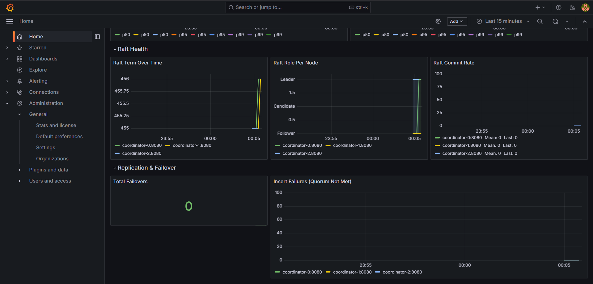

<div align="center">

# Nano-DB

[](https://en.cppreference.com/w/cpp/17)
[](https://github.com/shlokkvaishnav/Distributed-Nano-DB/actions)
[](LICENSE)
[](https://github.com/shlokkvaishnav/Distributed-Nano-DB/pkgs/container/nano-db)

**A Raft-replicated vector database, built from scratch in C++17.**

> I built a 3-node Raft cluster backed by a custom HNSW engine to find out what actually happens when you kill the leader mid-write.
> Answer: the cluster re-elects in under a second and zero confirmed writes are dropped.

</div>

---

## What this is

A distributed vector database built from first principles in C++17 — no consensus library, no managed queue, no distributed key-value store. Every distributed systems primitive here is implemented from scratch: the Raft log, the quorum write protocol, the consistent hash ring, the epoch fence.

**If you need a production vector database, use [Qdrant](https://qdrant.tech) or [Milvus](https://milvus.io).** This project exists to understand what's inside them. Raft consensus, quorum writes, and scatter-gather fan-out are the mechanisms that make Qdrant work; this codebase implements the same primitives from scratch to make them inspectable, testable, and breakable.

The non-trivial part isn't any one mechanism in isolation — it's making them compose correctly under failures, where the bugs are timing-dependent and only surface under load with random process kills.

---

## The demo: kill the leader

```
$ ./cluster.sh up
Starting Nano-DB cluster (9 containers)...
Waiting for Raft leader election...
  Elapsed: 8s — leader elected.

Cluster ready.

  API:     http://localhost:8080
  Grafana: http://localhost:3000  (admin / nanodb)

$ python3 scripts/demo_chaos.py

============================================================
  Nano-DB Chaos Demo: Kill the Leader, Lose Zero Writes
============================================================

Cluster is up. Current leader: coordinator-0 (term=3)

[1/3] Inserting 100 vectors (4 concurrent writers)...
  Inserted 100/100 confirmed.

[2/3] Killing the Raft leader...
  Leader: coordinator-0 (term=3)
  Container: nano-db-coordinator-0-1
  Command: docker kill nano-db-coordinator-0-1

  Writing continues through the outage window...

[3/3] Waiting for new leader...

  New leader: coordinator-1 (term=4)
  Election time: 0.71s

  Verifying all confirmed writes are still searchable...

============================================================
  Results
============================================================
  Vectors confirmed before kill:  100
  Writes dropped:                 0
  Election time:                  0.71s
  Cluster element count after:    100

  All confirmed writes survived the leader kill.
  See Grafana (localhost:3000) for failover_total and vectors_total graphs.
```

Raft term jumps 455→456 as coordinator-1 wins the election; shard failovers=0 and insert failures=0 throughout — the Raft layer absorbed the leader kill with zero data-plane disruption:



---

## Quick start

```bash
git clone --recurse-submodules https://github.com/shlokkvaishnav/Distributed-Nano-DB.git
cd Distributed-Nano-DB
./cluster.sh up
```

Insert a vector:

```bash
curl -X POST localhost:8080/vectors \
  -H "Content-Type: application/json" \
  -d '{"id": "v1", "vector": [0.1, 0.2, ...128 values...], "metadata": "hello"}'
```

Search:

```bash
curl -X POST localhost:8080/search \
  -H "Content-Type: application/json" \
  -d '{"vector": [0.1, 0.2, ...], "k": 5, "consistency": "strong"}'
```

Kill the leader and verify zero data loss:

```bash
python3 scripts/demo_chaos.py
```

Run 60 seconds of continuous random process kills across all 12 nodes:

```bash
./cluster.sh chaos
```

---

## Architecture


**Control plane (Raft group).** Three coordinator nodes form a Raft cluster. The elected leader handles all write coordination — failover decisions, shard membership changes, and primary promotions all flow through Raft consensus. Any coordinator can be killed; the remaining two elect a new leader within a second and resume without data loss.

**Data plane (sharded + replicated).** Vectors are distributed across shards via consistent hashing with 200 virtual nodes. Each shard has 3 replicas. Writes require a quorum — the primary's acknowledgement is mandatory. A write that reaches 2 secondaries but not the primary is correctly rejected, even though it's technically a majority. This matters during failover: the primary is the source of truth.

**Failover.** A background health-check loop on the Raft leader detects primary failures after 3 consecutive missed pings (~3 seconds). It promotes the replica with the highest element count — the most complete one — not just the first reachable one. That distinction was a real bug, found by the chaos harness.

---

## Fault tolerance

Three invariants that the chaos harness validates continuously:

1. **No confirmed write disappears.** Any write that received HTTP 201 (quorum met) must survive any combination of process kills. "Quorum met" means the primary acknowledged and at least one secondary acknowledged.

2. **No split-brain.** No shard ever has two primaries simultaneously. Epoch tokens on every write ensure a demoted primary's in-flight requests are rejected by shards even before the new coordinator detects the failover.

3. **Full recovery.** After chaos stops, the cluster returns to a fully consistent state. No manual intervention required.

To verify yourself:

```bash
./cluster.sh chaos   # 60s of random kills, invariant report at the end
```

---

## Key features

| Category | What's built |
|----------|-------------|
| **Consensus** | Raft from scratch — leader election, log replication, Figure 8 safety, log compaction + InstallSnapshot |
| **Replication** | Primary-replica with quorum writes. Primary's acknowledgement is mandatory, not just majority |
| **Fencing** | Epoch tokens on every write — stale coordinators are rejected by shards after a failover |
| **Failover** | Automatic primary promotion based on replica completeness, not just reachability |
| **Routing** | Consistent hashing with 200 virtual nodes; sequential-ID clustering bug found and fixed |
| **Storage** | Custom HNSW, memory-mapped persistence, SIMD-accelerated (AVX2) distance kernels |
| **Chaos testing** | Continuous random process kills with data integrity invariants validated throughout |
| **Observability** | Prometheus metrics + Grafana dashboard (auto-provisioned) |

---

## Performance

Measured with Docker Compose on a single host (2 shards × 3 replicas + 3 Raft coordinators, Docker bridge network). All cluster numbers include HTTP and replication overhead.

| Metric | Value | Notes |
|--------|-------|-------|
| Cluster insert throughput | **146 vec/s** | 4 concurrent clients, quorum writes<sup>1</sup> |
| Search latency p50 | **5.9 ms** | scatter-gather across 2 shards |
| Search latency p95 | **10.4 ms** | |
| Search latency p99 | **27.9 ms** | slowest shard gates the result — see [tail latency](#tail-latency-in-scatter-gather) |
| Failover recovery | **0.5 s** | primary killed, replica promoted by element count |
| Raft leader election | **< 1 s** | randomized 300–600 ms timeouts |
| Single-node insert | **6,500 TPS** | 8 threads, no replication, no HTTP overhead |
| Single-node search | **0.15 ms** | |
| Recall@10 | **95%** | |

<sup>1</sup> 163 vec/s at 8 concurrent clients; 146 vec/s is the reproducible 4-client result from `benchmarks/cluster_benchmark_results.json`. To reproduce: `./cluster.sh up && python3 benchmarks/cluster_benchmark.py`.

### Benchmark methodology

- **Hardware:** all nodes on a single host via Docker Compose (Docker bridge network round-trip: ~0.1 ms)
- **Warm-up:** 500 vectors inserted before the measurement window opens
- **Query mix:** random 128-dimensional unit vectors, k=10, `"consistency": "strong"`
- **Competitor comparisons** (`benchmarks/compare_against_competitors.py`) measure FAISS and hnswlib as direct in-process library calls with no HTTP or replication overhead — an apples-to-oranges comparison against Nano-DB's cluster numbers, but the right baseline for the single-node storage engine

### Tail latency in scatter-gather

In a fan-out search across N shards, the coordinator must wait for all N shards before merging and returning results. This means:

```
p99_end_to_end ≈ max(p99_shard_0, p99_shard_1, ..., p99_shard_N)
```

p50 stays roughly flat as shard count grows (more parallelism), but p99 worsens monotonically — you're sampling deeper into the tail of the per-shard distribution on every single request. Measured against a live 167k-vector cluster, then projected to higher shard counts using order statistics (`p99 of max(N) = F⁻¹(0.99^{1/N})`):

| Shards | p50 (ms) | p95 (ms) | p99 (ms) | p99.9 (ms) | Notes |
|--------|----------|----------|----------|------------|-------|
| 1 | 5.5 | 10.1 | 19.9 | 26.2 | single shard, no fan-out |
| **2** | **5.5** | **10.1** | **19.9** | **26.2** | **current cluster (measured)** |
| 4 | 6.8 | 16.1 | 25.3 | 26.5 | modeled |
| 8 | 8.3 | 23.0 | 26.1 | 26.5 | modeled |
| 16 | 11.0 | 24.5 | 26.3 | 26.6 | modeled |

The p99 ceiling (~26ms) reflects the hard maximum in this Docker-on-single-host setup where intra-host network jitter is minimal. On a real multi-machine deployment with network-level tail latency, the effect is more pronounced — the modeled values understate the real divergence at scale.

To reproduce: `python3 benchmarks/tail_latency_analysis.py` (requires cluster running).

---

## Raft consensus


The Raft implementation is the centrepiece of this project, built from the paper with no external library.

**Leader election** uses randomized timeouts (300–600 ms) to prevent split votes. A candidate only wins if its log is at least as up-to-date as the voter's — not just term comparison, but a compound check on both term and index that prevents a stale node from becoming leader.

**The Figure 8 commit rule** — the hardest part of Raft — is implemented as a pure function (`compute_new_commit_index`) and tested with a constructed adversarial 5-node scenario plus a mutation test that proves the check is load-bearing, not incidental.

**Log compaction** snapshots the cluster topology every 64 committed entries and installs snapshots on lagging followers instead of replaying full history.

---

## Observability

```bash
./cluster.sh up   # monitoring stack is included
```

Grafana at `localhost:3000` (admin/nanodb) with a pre-built dashboard: cluster throughput, search latency percentiles, Raft term changes, failover events, and per-shard stats. All panels are backed by 14 Prometheus metrics exported at `GET /metrics` on every coordinator.

---

## Testing

**Unit tests (10):** Raft Figure 8 commit safety (adversarial 5-node scenario + mutation test), log compaction, consistent hash ring distribution, sequential-ID routing, ID map store persistence, concurrent config writes, HNSW correctness, SIMD distance accuracy, and mmap persistence.

```bash
mkdir build && cd build
cmake .. -DCMAKE_BUILD_TYPE=Release -DNANODB_BUILD_CLUSTER=ON
cmake --build . -j$(nproc)
ctest --output-on-failure
```

**Chaos harness** (standalone, no Docker required — runs binaries directly):

```bash
python3 chaos_harness.py --duration 60
```

Orchestrates the full cluster from binaries, runs continuous writes, randomly kills and restarts any of the 12 processes (9 shard replicas + 3 coordinators), and validates the three fault-tolerance invariants throughout.

---

## Building from source

```bash
mkdir build && cd build
cmake .. -DCMAKE_BUILD_TYPE=Release \
         -DNANODB_BUILD_PYTHON=OFF \
         -DNANODB_BUILD_SERVER=ON \
         -DNANODB_BUILD_CLUSTER=ON
cmake --build . -j$(nproc)
ctest --output-on-failure   # 10 tests
```

Requires: CMake 3.16+, g++ 13+, `protobuf-compiler`, `libgrpc++-dev`, `libomp-dev`.

For Docker deployment only, the build happens inside the container — no local toolchain required.
